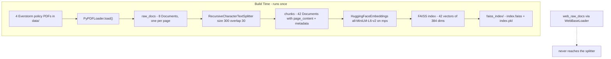
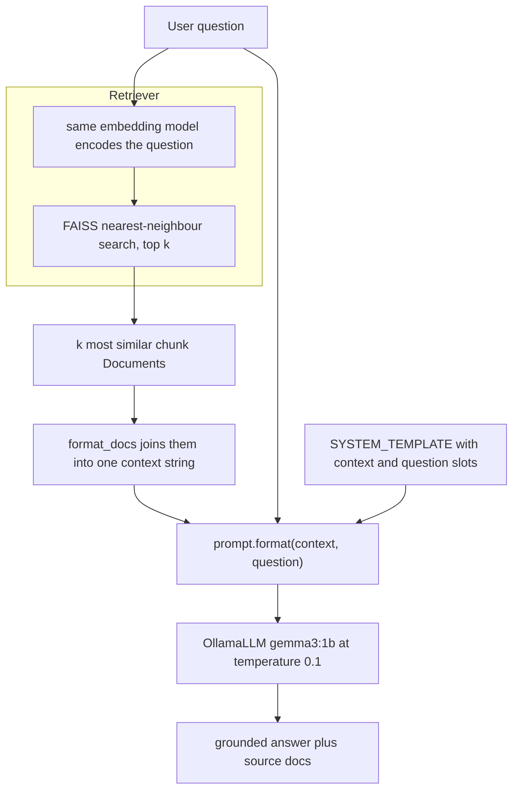

# ByteByteAI — Running Study Notes

Cumulative summary for the course. One section per project, appended as we go.
Each section captures: the problem, the design and why, the bugs and their root causes,
and a mastery checklist to self-test against later.

Checklist convention: `[ ]` not yet demonstrated, `[x]` explained back correctly in my own words.

---

## Progress ledger

| Week | Project | Topic | Status |
|------|---------|-------|--------|
| 1 | `Week1/project_1/llm_playground.ipynb` | LLM foundations / prompting playground | Notebook complete, notes not yet written up |
| 2 | `Week2/project_2/rag_chatbot.ipynb` | RAG customer-support chatbot | Phase 1 (indexing) done; Phase 2 (retrieval chain) stubbed |

---

## Week 2 — Project 2: RAG Customer-Support Chatbot

Build a chatbot that answers customer questions about "Everstorm Outfitters" using only
the store's own policy documents, running entirely locally.

### The problem, and why it exists

An LLM on its own has two failure modes that make it unusable as a support bot:

1. **It doesn't know your private data.** `gemma3:1b` was never trained on Everstorm's
   return policy, because Everstorm is fictional and its PDFs live on my laptop.
2. **It will confidently invent an answer anyway.** Asked "what's your refund window?",
   a bare LLM produces a plausible-sounding number. For a support bot that is worse than
   silence, because a wrong policy quoted to a customer is a real business liability.

The naive fix — paste all four PDFs into the prompt — fails on **context window**. A 1B
model has a small window, the four PDFs are far larger, and even if they fit, attention
degrades over long irrelevant text and every call gets slow and expensive.

RAG is the response to that constraint: don't send the whole corpus, send only the few
passages that are actually relevant to *this* question, and instruct the model to use
nothing else.

### Architecture

The single most important structural idea: **two phases with very different lifetimes.**
Indexing is slow, runs once, and its output is persisted. Querying is fast and runs per
question. Confusing the two is the root of most RAG bugs.

**Phase 1 — Build the index (offline, run once)**



**Phase 2 — Answer a question (online, per question)**



### Design decisions and the reasoning

**The same embedding model appears in both phases.** This is the load-bearing invariant.
An embedding is only meaningful relative to the model that produced it — two models place
"refund" at completely different coordinates. If the query were encoded by a different
model than the chunks, nearest-neighbour search would return arbitrary chunks and *would
not raise an error*. This is why `FAISS.from_documents(chunks, embeddings)` demands the
model **object** rather than precomputed vectors: the vector store keeps it so it can
encode queries later.

**Verified experimentally** (2026-07-26). Loaded the real `faiss_index/`, then replaced
only the query-side embedding with a permutation of the same model's output — identical
384 dims, identical norm, different coordinate system, i.e. exactly what "a different
model" looks like to FAISS. Query: *"What is the return window for a refund?"*

| Setup | Outcome |
|-------|---------|
| Same model both sides | top-3 all refund-related, L2 ≈ 1.05–1.16 |
| Different 384-dim model | **no exception raised**, 0 of 3 chunks shared with the correct result, L2 ≈ 1.78–1.80 |
| 768-dim model vs 384-dim index | bare `AssertionError` with an **empty** message |

Three lessons. First, FAISS validates *dimensionality only* — it has no way to know which
model produced a vector, so a same-dim mismatch sails straight through. Second, the
mismatched hits were superficially plausible (one was literally the RETURN & EXCHANGE
POLICY header), so the LLM receives on-topic-looking but wrong context and may answer
confidently — the exact hallucination RAG was meant to prevent. Third, the distances *did*
degrade (1.05 → 1.78), so the signal exists; nothing in the pipeline checks it. A
`score_threshold` on the retriever is what converts that silent failure into a visible one.

**Chunking at 300 characters with 30 overlap.** Size is bounded by the model's context
window and by retrieval precision — a whole page as one chunk dilutes the relevant
sentence with unrelated text, dragging its vector toward the page's average meaning.
The overlap is insurance against a boundary cutting through the sentence that answers
the question; with overlap, that sentence appears whole in at least one chunk.

**`all-MiniLM-L6-v2` (384 dims) over OpenAI `text-embedding-3-small`.** Local, free,
no API key, reproducible offline. Weaker, but this corpus is 42 chunks.

**`temperature=0.1` on the LLM.** Near-greedy decoding. For extractive question
answering we want the most likely continuation, not a creative one. Temperature is a
*creativity* knob and creativity is the enemy here.

**The system prompt does grounding work the retriever cannot.** Retrieval always returns
its top-k, even when nothing relevant exists — similarity search has no concept of "no
good match". So the prompt must explicitly authorise "I don't know based on the retrieved
documents." Without that instruction, the model fills the gap with invention.

**`save_local("faiss_index")`.** Embedding 42 chunks takes seconds now, but the pattern
matters: an index is a build artifact. The Streamlit app should `load_local` it, not
rebuild on every startup.

### Bugs hit, and their root causes

**1. `AttributeError: 'Document' object has no attribute 'replace'`**

```python
# broken
chunks_embeddings = embeddings.embed_documents(chunks)
vector_store = FAISS.from_documents(chunks, chunks_embeddings)

# fixed
vector_store = FAISS.from_documents(chunks, embeddings)
```

Two independent mistakes, only one of which the traceback showed:

- *Naming trap.* `embed_documents(texts: list[str])` — "documents" there means **raw
  strings**, not LangChain `Document` objects. Internally it runs
  `[x.replace("\n", " ") for x in texts]`; a `Document` is a Pydantic model with no
  `.replace`, so Pydantic's `__getattr__` raised. Correct input would have been
  `[c.page_content for c in chunks]`.
- *Latent second bug.* `from_documents(documents, embedding)` wants the model, not
  vectors. Passing floats might have indexed but would have broken
  `similarity_search()` later — a far harder bug to trace, because it surfaces in a
  different cell than its cause.

Both collapse because `from_documents` already extracts `page_content` and `metadata`
and calls `from_texts` internally. The manual embedding line wasn't just wrong, it was
redundant. Count switched to `vector_store.index.ntotal`, FAISS's own vector count.

**2. `NameError: name 'context' is not defined`**

```python
# broken
ChatPromptTemplate = context + question

# fixed
prompt = ChatPromptTemplate.from_template(SYSTEM_TEMPLATE)
print(prompt.format(context="Standard orders ship within 2 business days.",
                    question="How fast do orders ship?"))
```

- `context` and `question` are **placeholder names inside the template string**
  (`{context}`, `{question}`), not Python variables. Prompt building is slot-filling,
  not string concatenation. `from_template` parses the string, discovers
  `input_variables == ['context', 'question']`, and returns a reusable object.
- The payoff of that object: it **validates**. `prompt.format(context="x")` errors on
  the missing `question` instead of silently sending a literal `{question}` to the LLM.
- Quieter second bug: assigning to `ChatPromptTemplate` **rebinds the imported class**,
  destroying it for every later cell. Would have produced a baffling failure in 5.2,
  far from its cause.

Note `from_template` wraps everything in a single *human* message (output is prefixed
`Human:`). Acceptable here because `SYSTEM_TEMPLATE` embeds `{question}` inline. A true
system message would be
`ChatPromptTemplate.from_messages([("system", SYSTEM_TEMPLATE), ("human", "{question}")])`.

Also: use `.format()` (returns `str`) rather than `.invoke()` (returns `PromptValue`),
because `OllamaLLM` is a string-in/string-out LLM.

**Pattern across both bugs:** an argument was the right *shape* but the wrong *kind*, and
LangChain's permissive signatures let it through until something deep in the call stack
tried to use it. Read what a parameter is declared as, not just what it's named.

### Environment notes

The notebook offers Conda (Option 1) or uv (Option 2). No conda on this machine; used uv,
which loses nothing because `environment.yaml` is just a conda wrapper around the same
pip list as `requirements.txt` (Python 3.11 + 13 packages).

```bash
uv venv .venv --python 3.11 && source .venv/bin/activate
uv pip install -r requirements.txt
python -m ipykernel install --user --name=rag_chatbot --display-name "rag_chatbot"
brew install ollama && ollama serve      # separate terminal
ollama pull gemma3:1b
```

`sentence-transformers` pulls PyTorch, so the install is multi-GB. `device="mps"` uses
Apple Silicon GPU.

### Known gaps in the current notebook

- `web_raw_docs` is fetched but never chunked or indexed — only the 4 PDFs are searchable.
- `as_retriever`, `format_docs`, and `rag_step` are still `pass`. The 5.3 test loop will
  raise `TypeError` on `result['answer']` because `rag_step` returns `None`.
- `app.py` (Streamlit UI, section 6) is a stub.

### Why this matters beyond the exercise

This is the default architecture for grounding an LLM on private data — internal support
bots, documentation search, compliance Q&A. The scaling story changes but the shape does
not: FAISS becomes a hosted vector DB, the local embedding model becomes a hosted one,
`gemma3:1b` becomes a larger model. The two-phase split, the shared-embedding-model
invariant, and the "refuse when context is missing" prompt discipline all survive.

Retrieval quality dominates. A strong model over bad retrieval produces confident wrong
answers; a weak model over good retrieval mostly works. Debugging effort belongs on
chunking, embeddings, and `k` before prompt-tuning.

### Mastery checklist — Week 2

Problem framing
- [ ] Explain why a bare LLM can't answer Everstorm questions, naming both failure modes
- [ ] Explain why "just paste all the PDFs into the prompt" fails
- [ ] State what RAG trades away versus full-context (retrieval can miss)

Mechanics
- [ ] Walk both phases end to end without looking at the diagram
- [ ] Say which artifacts are persisted and which are rebuilt per query
- [ ] Explain what a `Document` is and how it differs from a `str`
- [ ] Explain what `index.ntotal` and the 384 dims each mean
- [ ] Describe what `as_retriever(search_kwargs={"k": ...})` returns and what `k` controls

The key invariant
- [x] Explain why the same embedding model must serve both phases
- [x] Predict what happens with mismatched models — and why it does *not* raise
      *(missed first attempt — expected a dimension-mismatch error. Corrected via the
      experiment above, then confirmed on the production-scenario transfer question:
      fluent answers citing wrong policies, clean logs. FAISS never records which model
      built the index, so it has nothing to compare against.)*
- [x] Explain why `from_documents` takes the model object, not vectors
- [x] Name the operational rule: changing the embedding model always means re-indexing,
      and the index should be stamped with the model that built it

Design decisions
- [ ] Justify chunk size 300 and why it isn't 30 or 3000
- [x] Justify overlap 30 and the failure it prevents
- [ ] Justify `temperature=0.1`
- [ ] Explain what the system prompt guards that retrieval cannot

Debugging
- [ ] Reproduce the reasoning from `'Document' has no attribute 'replace'` to root cause
- [ ] Explain why the second bug in that cell was more dangerous than the crash
- [ ] Explain the difference between a template placeholder and a Python variable
- [ ] Explain why rebinding `ChatPromptTemplate` is a landmine

Context
- [ ] Describe what changes and what stays the same at production scale
- [ ] Argue why retrieval quality matters more than model size here

### Self-test questions

1. I swap the embedding model to a 768-dim one but reuse the saved `faiss_index/`.
   What happens, and at which line?
2. `k=1` versus `k=10` — describe a question that each gets wrong and why.
3. A chunk lands mid-sentence, splitting "Returns are accepted within 30" from
   "days of delivery." What does the bot answer about the return window, and does
   overlap save it?
4. Why does `format_docs` need to include metadata for rule 4 of the system prompt to work?
5. The bot says "I don't know based on the retrieved documents" for a question the PDFs
   clearly answer. List the candidate causes in the order you'd check them.
